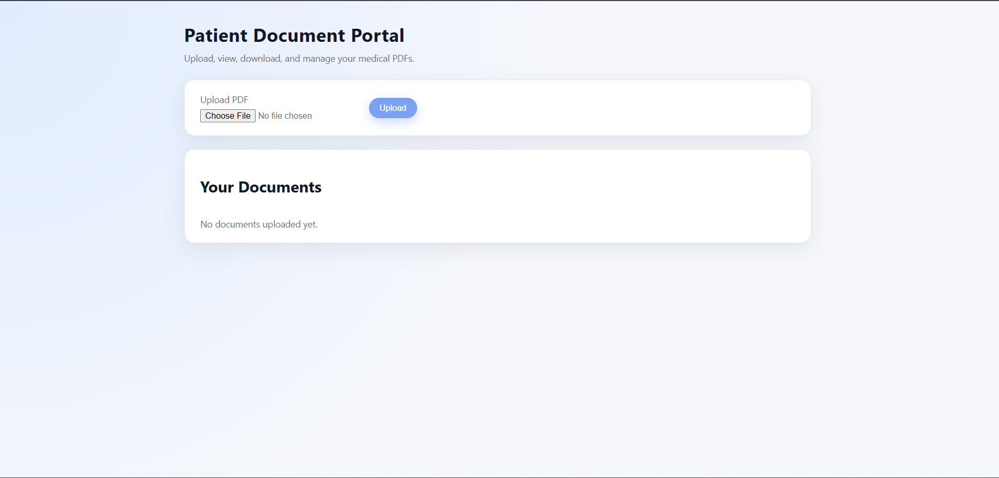
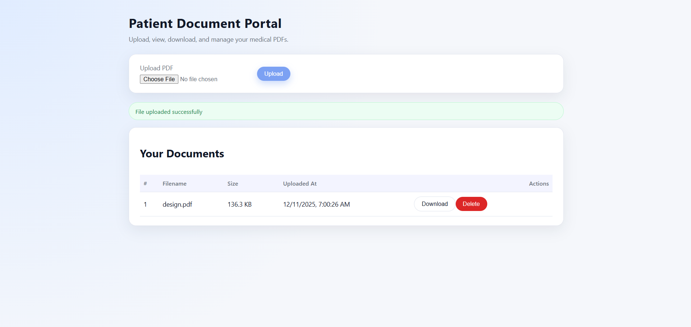

# 📄 Patient Document Portal – Full Stack Assignment

A complete full-stack application that allows a patient to:

- Upload PDF medical documents  
- View all uploaded files  
- Download any file  
- Delete a file  


---
## 📸 Screenshots

Below are screenshots of the project UI.  
Add your actual images by replacing the paths.

### **1️⃣ Home Page (Document List)**


### **2️⃣ Upload PDF Form**


### **5️⃣ Deleting a Document**


---

## 🚀 How to Run the Project Locally

Make sure **Node.js** is installed.


 🔵 1. Backend Setup (server/)
```bash
Step 1 — Navigate:

cd server
Step 2 — Install dependencies:
npm install

Step 3 — Create a .env file:
PORT=5000

Step 4 — Start backend:
node index.js
```
🟢 2. Frontend Setup (frontend/)
```bash
Step 1 — Navigate:
cd frontend

Step 2 — Install dependencies:
npm install

Step 3 — Start development server:
npm run dev


Frontend will be available at:

http://localhost:5173

```

🌐 Backend API Overview

Base URL: http://localhost:5000/api


## 🧪 Example API Calls (Postman)

Below are example requests for testing the API using **Postman**.

---

### 1️⃣ Upload PDF  
**Endpoint:** `POST /api/documents/upload`  
**Description:** Upload a PDF file using `multipart/form-data`.

#### 📌 Steps in Postman:
1. Open Postman → Click **New → HTTP Request**
2. Select **POST**
3. Enter URL:  
4. Go to **Body → form-data**
5. Add a field:
- **Key:** `file`  
- **Type:** *File*  
- **Value:** Select a PDF file
6. Click **Send**

#### ✅ Sample Response:
```json
{
"id": 1,
"filename": "report.pdf",
"filepath": "C:\\server\\uploads\\171234567-report.pdf",
"filesize": 24896,
"created_at": "2025-12-10T13:30:05.250Z"
}


